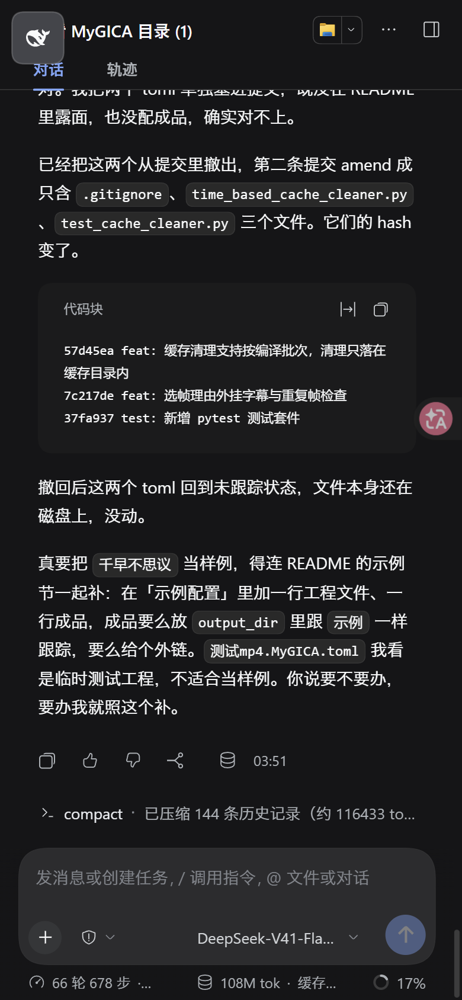
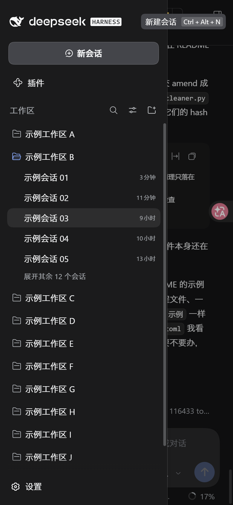

# dsh·手机适配插件

窄屏下把 DSH 的侧栏改成手机能用的形态：收起时是左上角一个悬浮小方块，展开时是覆盖式抽屉，点会话自动收起，并压掉切会话时的自动聚焦，避免软键盘把页面顶起。

纯浏览器端插件，不改任何原生界面与内置样式，只在窄屏加副作用。

## 引言

<!-- 本节由作者本人撰写，AI 不代笔。 -->
让 DSH 在手机浏览器里顺手一点。

## 功能

三条行为都只在窄屏生效，视口宽度小于 1024 像素时算窄屏，宽屏下插件完全不介入。

- 收起态：侧栏列压到零宽，中央区拿回整幅宽度，左上角出现一个 44 像素的悬浮方块，点它展开侧栏。
- 展开态：侧栏变成 280 像素宽的覆盖式抽屉，压在对话之上，右侧有一层遮罩，点遮罩或点侧栏里的收起按钮即可关掉。
- 点会话自动收起：在抽屉里点任意会话行，侧栏立刻收起，把屏幕让回对话；点行内的更多按钮不触发。
- 压键盘：切会话后输入框会无条件夺回焦点，手机上这会拉起软键盘并把页面顶起，插件压掉紧随会话点击的那一次聚焦，并持续压制一秒半；用户主动点输入框就立即放弃压制。

## 截图





展开态里的会话名与工作区名已替换为示例。

## 使用

用 Edge 或手机浏览器打开 DSH web，把窗口缩到 1024 像素以下，或直接在手机上访问，就能看到收起态的小方块。点方块展开抽屉，点任一会话收起。

已在 Xiaomi 14 上实测，1200×2670 的屏幕正常触发。

方块图标直接克隆内置收起栏的鲸鱼标记，跟随后续版本的品牌变化；拿不到内置图标时方块不显示，插件不自造兜底图标，收起态的布局副作用也一并跳过，侧栏保持内置形态，不会出现收起了却没有展开入口的局面。

## 安装

**从 GitHub 安装**：源码在 `src/`，`lib/` 不入仓库，安装时 npm 会触发 `prepare` 脚本现场构建。

```powershell
dsh plugin --profile web add github:better-er/dsh-mobile-drawer
```

**从 npm 安装**：包内已含构建产物 `lib/index.js` 与 `lib/client.js`，安装时不再构建。

```powershell
dsh plugin --profile web add dsh-mobile-drawer
```

两种方式装完都会自动挂载，重启 DSH web 后启用，无需手工编辑任何文件。

## 卸载

```powershell
dsh plugin --profile web remove dsh-mobile-drawer
```

彻底移除，重启 DSH web 后不再加载。

## 工作原理

浏览器半身只借 `ctx.layout.toggleSidebar()` 翻转内置的窄屏侧栏状态，其余全走 DOM 副作用：注入一段只对窄屏生效的样式，给 body 挂状态类，创建一个悬浮方块与一层遮罩，再用捕获阶段的 `click`、`focusin`、`pointerdown` 监听完成收起与聚焦压制。

窄屏判定与内置对齐，用的是 `max-width: 1023.98px`。收起态直接覆盖 AppFrame 的网格轨道，把侧栏列压到零宽；展开态把侧栏根节点绝对定位成 280 像素的抽屉，这样不会脱离网格放置，中央区始终是整幅宽度。完整设计见 [设计说明](docs/design.md)。

## 要求与开发

- 是标准形态的 dsh client 插件，声明 `dsh.client`，导出 `./client`。
- 同时声明了 `dsh.bundle`，因此也是一个自挂载的 bundle 层插件：用 `dsh plugin --profile <name> add` 从 GitHub 安装后会被自动识别为 profile layer 并挂载，无需手工写组合 entry。
- 浏览器半身依赖 `layout` 服务；宿主入口没有运行时行为，只为让包能被 Loader 加载。
- 构建型插件：`src/` 是 TypeScript 源码，`lib/` 是构建产物且不入库，安装或发布前由 `prepare` 构建。

## 开发

```powershell
pnpm install
pnpm run typecheck   # tsc --noEmit 严格类型检查
pnpm run build       # tsdown，产出 lib/index.js 与 lib/client.js
```

- `src/index.ts`：宿主入口，无运行时行为，只用于让包被 Loader 加载。
- `src/client/index.ts`：浏览器半身，窄屏侧栏与聚焦压制。
- 构建用 tsdown，client 产物是 `window.__ModuleLoader__.load({ id, factory })` 的注册式模块，`@deepseek-ai/cordis` 保持外部依赖。

## License

[MIT](./LICENSE)
